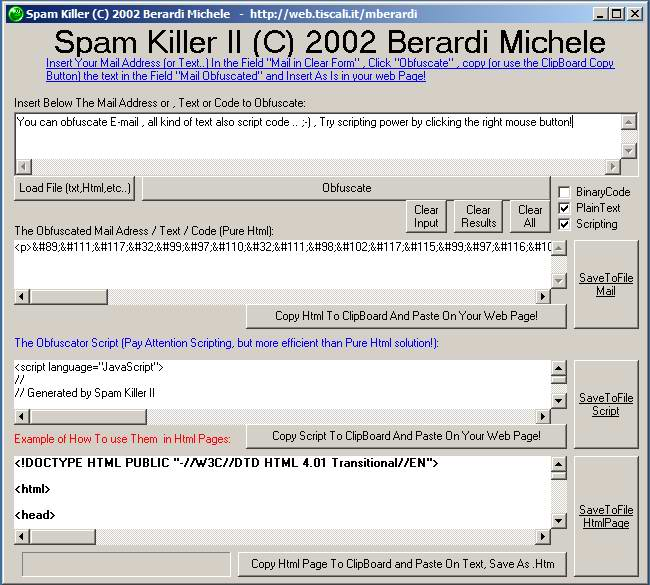



## A Spam Killer II \(now use scripting for obfuscate mail and also code\.\.\.\) and much more\! ANTI SPAM\!

### Description

ANTI SPAM , THIS PROGRAM COMBAT SPAMMING

SOME MINOR BACK COMPATIBILITY TIPS AND

CODE READ ENHANCEMENTS, DUE TO AN USER

WHO SUGGEST ME THIS, USING NOT EVEN A

CIVIL LANGUAGE IN SOME CASES.

when i wrote :

http://www.planetsourcecode.com/vb/scripts/ShowCode.asp?txtCodeId=38851&lngWId=1

this was only a way to explain some tips about anti spam techniques,

the porpose of this code si to extend the war to spammers , customizing more part of the code

such html include files and the purpose to use

scripting instead of pure html.
 
### More Info
 

             |
---                |---
**Submitted On**   |2002-09-12 00:25:14
**By**             |[michele berardi](https://github.com/Planet-Source-Code/PSCIndex/blob/master/ByAuthor/michele-berardi.md)
**Level**          |Advanced
**User Rating**    |4.4 (40 globes from 9 users)
**Compatibility**  |VB 3\.0, VB 4\.0 \(16\-bit\), VB 4\.0 \(32\-bit\), VB 5\.0, VB 6\.0
**Category**       |[Complete Applications](https://github.com/Planet-Source-Code/PSCIndex/blob/master/ByCategory/complete-applications__1-27.md)
**World**          |[Visual Basic](https://github.com/Planet-Source-Code/PSCIndex/blob/master/ByWorld/visual-basic.md)
**Archive File**   |[Spam\_Kille1299329112002\.zip](https://github.com/Planet-Source-Code/michele-berardi-a-spam-killer-ii-now-use-scripting-for-obfuscate-mail-and-also-code-and-mu__1-38876/archive/master.zip)

